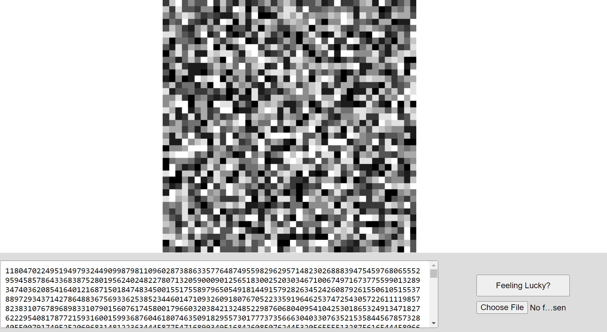
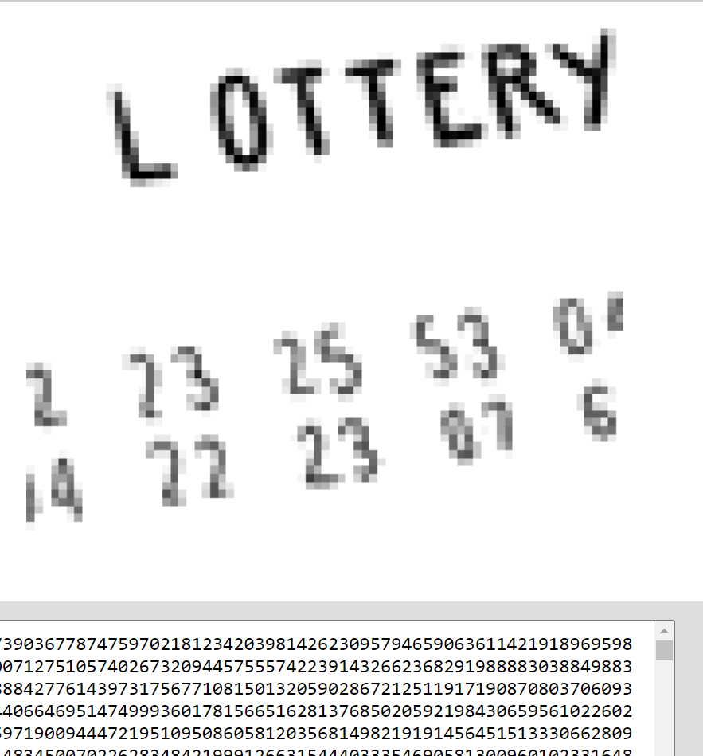

# Project

This is a fun 'art' project built together with my dad. The main functionality is a UI that allows users to play and experiment with converting really big numbers into images and vice versa. The idea is that every image you can imagine—whether it's a picture of how you'll look when you're 80, the view from the top of Mount Everest, or the winning lottery numbers for next week—exists somewhere within a grid of pixels, each associated with a unique number. You can start from a randomly generated number and start editing it to see how it influences the output image, or start form an uploaded an image and go from there.

The underlying philosophy is that all images exist somewhere within this grid and can be retrieved with the right number, if only we had the right number... However, in practice, almost all numbers will generate meaningless noise due to the random configuration of pixels (insert interesting link with entropy). But that's part of the fun! Press the "Feeling Lucky?" button to test your luck and see if you can generate something interesting. Who knows, you might stumble upon an image of next week's lottery numbers or a hidden masterpiece!

On the flip side, you can also upload an image and retrieve its magic number. Imagine finding the unique number that represents your favorite photo!

You can set the grid size and the amount of greyscale values (e.g. resolution of the image) as environment variables.

<div style="display: flex; align-items: center;">
  
  
</div>


## Technologies Used

- **Frontend**: HTML, CSS, JavaScript
- **Backend**: Node.js, Express.js (deployed using Heroku)
- **Image Processing**: Sharp

## Live demo

Try out the [demo](https://arnepannemans.github.io/hiddenFutures/) (-> took it offline to save costs)

## Setup

### Prerequisites

- Node.js installed on your machine.

### Steps

1. Clone the repository.
2. Navigate to the project directory.
3. Install the dependencies and run the backend.

```bash
   npm install
   npm start
```
4. Run frontend

```bash
   npm run frontend
```

## Future research

Currently thinking of making the pixel generation process less `random` and more aligned with how natural images actually look. [Reference](https://hal.science/hal-00453249/document). The idea is that while now all possible pixel configurations are purely random, real images follow distributions generated by nature, and nature is not random!

### Future Research

- **Shannon Entropy**: Exploring ways to control the randomness of pixel values to better match the information content in natural images
- **Sampling Natural Images**: Using a set of 10 sample images to analyze their pixel distributions and then generate new images based on that data
- **Markov Random Fields (MRF)**: Trying out MRFs to capture how pixels relate to their neighbors, using techniques like Gibbs sampling to create new images with similar patterns
- **PixelCNN**: Using PixelCNN to model each pixel based on the previous ones
- **Generative Adversarial Networks (GANs)**: Same but more complex (more data, mode collapse stability issues etc)
